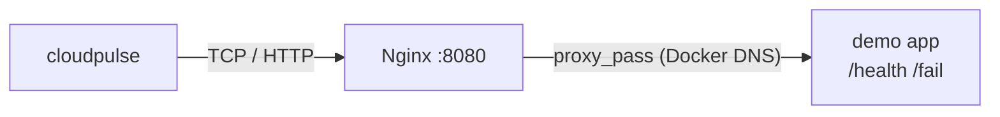

<p align="center">
  
</p>

<p align="center">
  <a href="https://github.com/udayramageri09/cloud-pulse/actions/workflows/ci.yml"></a>
  
  <a href="LICENSE"></a>
</p>

CloudPulse is a dependency-free Python CLI for the first minutes of an incident: it checks the host
(straight from Linux `/proc`) and the network path to a service (DNS, TCP, HTTP, TLS), then writes a
structured incident report with severities, symptoms and next steps. It ships with a Docker Compose
failure lab that reproduces real 500/503/502/504 errors, tested end to end in CI.

## Demo

<p align="center">
  <video src="docs/media/cloudpulse-demo.mp4" controls width="720">
  </video>
</p>

<p align="center"><a href="docs/media/cloudpulse-demo.mp4">cloudpulse-demo.mp4</a> -- 2:27, walks through the CLI, the Docker failure lab and the incident report format (recorded on 0.1.0).</p>

## Features

- **Host checks from `/proc`, no psutil:** CPU (two-sample delta of `/proc/stat`), load average per
  core, memory (`MemAvailable`), disk, uptime, top processes by resident memory.
- **Network checks, run concurrently:** DNS resolution, TCP connect, HTTP status and latency, and for
  `https://` URLs a verified TLS handshake with days until the certificate expires.
- **Incident reports:** each check gets a severity, an observed symptom and suggested next steps;
  text for humans, JSON for tools.
- **Monitoring-friendly exit codes:** Nagios convention (0 healthy, 1 degraded, 2 critical,
  3 unknown), with configurable warning thresholds.
- **A real failure lab:** Nginx in front of a small app, switchable between healthy, failing, not
  ready and down.
- **Tested at every level:** 39 unit and integration tests (92% coverage), a real local TLS server
  for certificate tests, and an end-to-end run of every lab scenario in CI.

## Quick start

```bash
python -m pip install -e .
cloudpulse --dns example.com --tcp example.com:443 --url https://example.com
```

Against the failure lab (`./simulation/lab.sh up`, Docker required):

```text
$ cloudpulse --tcp 127.0.0.1:8080 --url http://127.0.0.1:8080/health
CloudPulse Incident Report
Overall status: HEALTHY
Checks: 8 total - 8 info, 0 warning, 0 critical

[INFO] cpu - usage_percent=0.0, logical_cores=2
[INFO] load - load_1m=0.03, load_5m=0.05, load_15m=0.01, per_core_1m=0.01, logical_cores=2
[INFO] memory - usage_percent=5.7, available_bytes=7931510784, total_bytes=8413835264
[INFO] tcp (127.0.0.1:8080) - duration_ms=2.49
[INFO] http (http://127.0.0.1:8080/health) - http_status=200, duration_ms=9.37

$ cloudpulse --url http://127.0.0.1:8080/fail
[CRITICAL] http (http://127.0.0.1:8080/fail) - http_status=500, error=HTTP Error 500: Internal Server Error
    Symptom: http (http://127.0.0.1:8080/fail) failed: HTTP Error 500: Internal Server Error
    Next step: Compare with the TCP result: a reachable port with a failing HTTP response points at the application or proxy, not the network path
```

(Output trimmed. `--format json --output report.json` writes the full report as JSON.)

### Options

| Flag | Purpose |
|---|---|
| `--dns HOST`, `--tcp HOST:PORT`, `--url URL` | network checks to run (an `https://` URL also checks TLS) |
| `--cpu-warn`, `--mem-warn`, `--disk-warn PCT` | warning thresholds (default 90%) |
| `--tls-warn-days DAYS` | warn when the certificate expires sooner (default 14) |
| `--format text\|json`, `--output FILE` | report format and destination |
| `--verbose` | show symptoms and next steps for every check |

### Exit codes

| Code | Meaning |
|---|---|
| 0 | healthy: every check passed |
| 1 | degraded: at least one warning |
| 2 | critical: at least one check failed |
| 3 | unknown: invalid arguments |

## Failure lab


```mermaid
flowchart LR
    CP[cloudpulse] -->|TCP / HTTP| NGINX["Nginx :8080"]
    NGINX -->|"proxy_pass (Docker DNS)"| APP["demo app\n/health  /fail"]
```

| Scenario | Command | CloudPulse sees |
|---|---|---|
| Healthy | `./simulation/lab.sh up` | `/health` 200 |
| Application error | (none, request `/fail`) | 500 |
| App not ready | `./simulation/lab.sh unhealthy` | 503 |
| Upstream down | `./simulation/lab.sh stop-app` | TCP ok, HTTP 502 or 504 |
| Recovery | `./simulation/lab.sh healthy` | 200 |

`scripts/e2e_lab.sh` runs all five scenarios and checks each status; CI runs it on every push.
[docs/TROUBLESHOOTING.md](docs/TROUBLESHOOTING.md) explains what each failure means and how to
investigate it.

## Development

```bash
python -m pip install -e ".[dev]"
python -m pytest --cov=cloudpulse      # unit + integration tests
ruff check src tests && ruff format --check src tests
scripts/e2e_lab.sh                     # end-to-end against the Docker lab
```

```text
src/cloudpulse/   checks.py (host + network checks), report.py (incident model), cli.py
tests/            pytest suite; fixtures/proc is a fake /proc tree
simulation/       failure lab: demo app, nginx.conf, lab.sh / lab.ps1
scripts/          e2e_lab.sh
docs/             architecture, troubleshooting, deployment, screenshots, demo video
```

## Learn more

| | |
|---|---|
| [docs/ARCHITECTURE.md](docs/ARCHITECTURE.md) | Design decisions: /proc parsing, concurrency, TLS checks, testing strategy |
| [docs/TROUBLESHOOTING.md](docs/TROUBLESHOOTING.md) | Every lab scenario, with real logs |
| [docs/DEPLOYMENT.md](docs/DEPLOYMENT.md) | Docker image, GHCR, Codespaces, releases |
| [docs/images/](docs/images/) | Captured CLI, lab and test output |
| [CHANGELOG.md](CHANGELOG.md) | What has shipped |

## License

[MIT](LICENSE)
